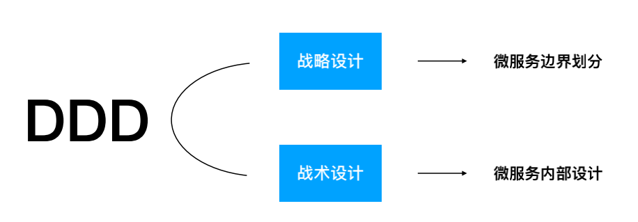
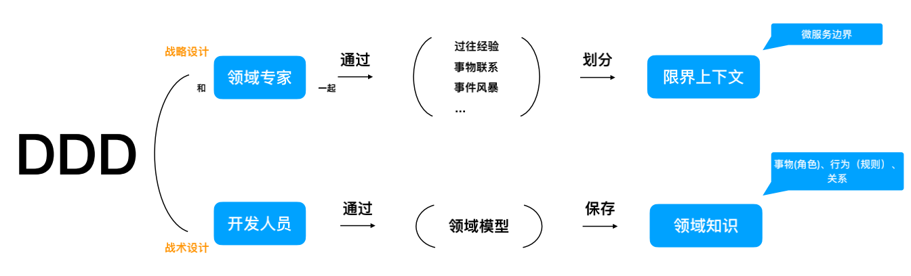
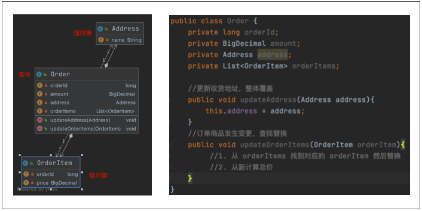
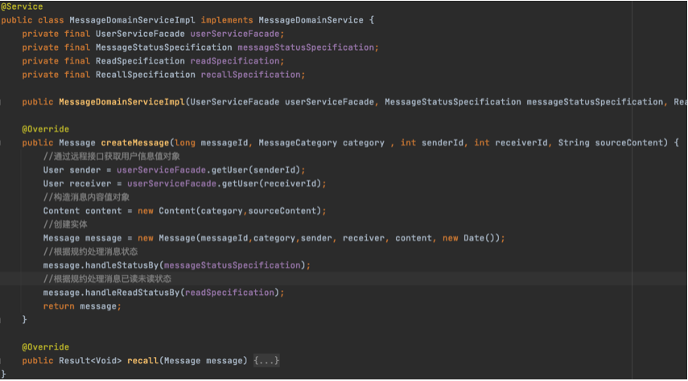
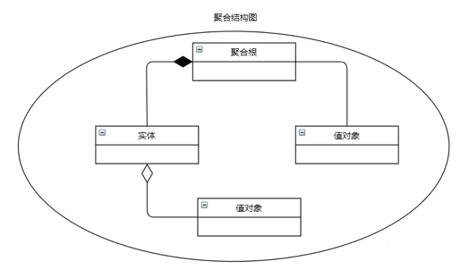
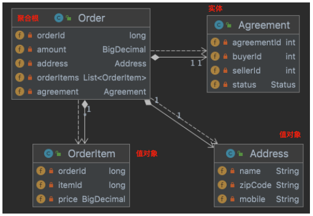
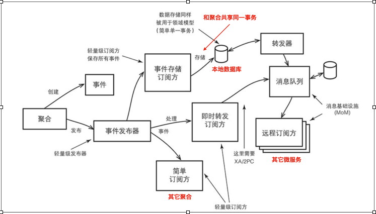
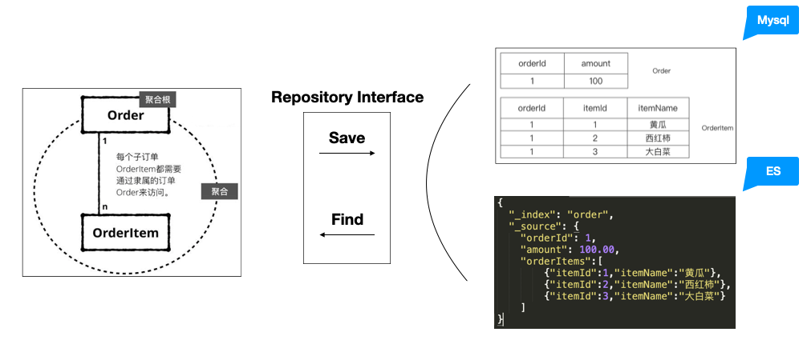
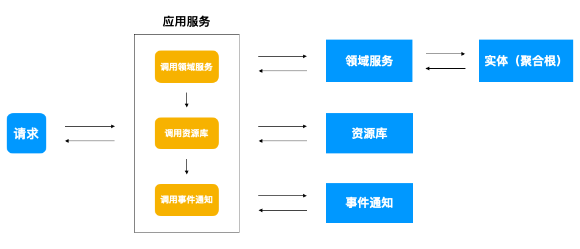

## DDD可以做什么

DDD主要分为两个部分，战略设计与战术设计，战略设计围绕微服务拆分，战术设计围绕微服务构建

## DDD怎么做

1. 领域专家与研发人员一起（研发人员可能就是领域专家），通过一系列的方式方法（DDD并没有明确说明用什么方法），划分出业务的边界，这个边界就是限界上下文，微服务可以以限界上下文指定微服务的拆分，但是微服务的拆分并不是说一定以限界上下文为边界，这里面还需要考虑其它因数，比如3个火枪手原则、两个披萨原则以及组织架构对微服务拆分的影响等。
2. 研发人员通过领域模型，领域模型就是DDD中用于指定微服务实现的模型，保存领域知识，通过这种方式DDD通过领域模型围绕业务进⾏建模，并将模型与代码进⾏映射，业务调整影响代码的同时,代码也能直接的反映业务。

## DDD领域模型

### 实体与值对象

* 实体的特征
1. 唯一标识，对唯一性事物进行建模
2. 包含了业务的关键行为，可以随着业务持续变化
3. 修改时，因为有唯一标识，所以还是同一个实体

在上图中，订单就是一个实体，因为他有订单的唯一ID，通过它可以表示订单这个事务的唯一性，并且在订单的整个生命周期，随着业务订单也在不断的变化，创建订单到订单完成，订单状态在不断的变化，但是因为它们有唯一的订单ID，所以它们就是同一个实体。

* 值对象的特征
1. 描述事物的某个特征，通常作为实体属性存在
2. 创建后即不可变
3. 修改时，用另一个值对象予以替换

在上图中，订单商品就是一个值对象，因为在订单语境下，商品就是订单的一个特征，同时订单中的商品在订单创建的那一刻就会被"快照"下来，如果商品的发生变化，比如价格从100元涨价到10000元，订单中的商品也不会同步去修改。
在此种业务语境下，订单商品就符合对值对象的描述，那么如果卖家修改订单中商品的价格怎么办呢，在DDD中通过覆盖的方式进行修改，而不是只修改一个价格属性。

除了订单商品外，收获地址也是一个值对象，那么收获地址可以是一个实体吗？ 答案是可以的，当业务在收获地址管理的上下文语境里的时候，收获地址就是一个实体。

> 更多对实体特征的描述，可以参考《实现领域驱动设计》一书

### 领域服务

领域服务可以帮助我们分担实体的功能，承接部分业务逻辑，做一些实体不变处理的业务流程,它不是必须的。
在上图中，描述的是一个创建消息的领域服务，因为消息的实体中有用户的值对象，但是用户的信息通常在另一个限界上下文，也就是另一个微服务中，因此需要通过一些facade接口获取，如果把这些接口的调用防在领域实体
中就会导致实体过于臃肿，且也不必保持其独立性，因为它需要被类似于Spring这样的框架进行管理，依赖注入一些接口,因此通过领域服务进行辅助是一种很好的方式。

### 聚合

将实体和值对象在一致性边界之内组成聚合,使用聚合划分限界上下文(微服务)内部的边界,聚合根做为一种特殊的实体，用于管理聚合内部的实体与值对象，并将自身暴露给外部进行引用。

比如在上图中描述的是一个订单聚合，在这个聚合中，它里面有两个实体，一个是订单一个是退货退款协议，显然退货退款协议应该依托于订单，但是它也符合实体的特征，因此被定义为实体。在此情况下，订单实体就是此聚合的聚合根。

#### 聚合的一致性边界

1. 生命周期的一致性，聚合对外的生命周期保持一致，聚合根生命周期结束，聚合的内部所有对象的生命周期也都应该结束。
2. 事务的一致性，这里的事务指的是数据库事务，每个数据库事务指包含一个聚合，不应该有垮聚合的事务

### 领域事件

领域事件表示领域中所发生的事情，通过领域事件可以实现微服务内的信息同步，同时也可以实现对外部系统的解耦。

如上图所示，聚合变更后创建领域事件，领域事件有两种方式进行发布。

1. 与聚合事务一起进行存储，比如存储进一个本地事件表，在由事件转发器转发到消息队列，这样保证的事件不会丢失。
2. 直接进行转发到消息队列，但是此时因为事件还未入口，因此需要在聚合事务与消息队列发布事件之间做XA的2PC事务提交，因为有2PC存在，通常性能不会太好。

> 除了向外部系统发布事件，限界上下文内部的多个聚合也可以通过一些本地事务发布器来进行事务的发布，比如Spring Event 或 EventBus等

### 资源库

资源库是保存聚合的地方，将聚合实例存放在资源库（Repository）中，之后再通过该资源库来获取相同的实例。

1. Save: 聚合对象由Repository的实现,转换为存储所支持的数据结构进行持久化
2. Find: 根据存储所支持的数据结构,由Repository的实现转换为聚合对象

### 应用服务

应用服务负责流程编排，它将要实现的功能委托给一个或多个领域对象来实现，本身只负责处理业务用例的执行顺序以及结果的拼装同时也可以在应用服务做些权限验证等工作。
